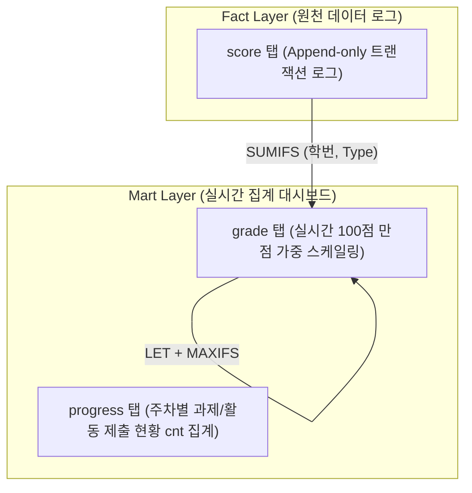

# 구글 시트 기반 실시간 가중치 성적 산출(grade) 아키텍처 및 구현 지침

> **문서 상태**: Approved & Deployed  
> **대상 시트**:
> - [웹프로그래밍(01, 02분반) 성적부 (Google Sheets)](https://docs.google.com/spreadsheets/d/1OMeWuYt45TZMygmkh5hOhqSCCUFYJv4iE0hTY554iAo/edit?gid=191465127#gid=191465127) (`grade` gid: `191465127`, `score` gid: `1892167835`)
> - [파이썬(04분반) 성적부 (Google Sheets)](https://docs.google.com/spreadsheets/d/1Ni4ZaeIJJdNNvysx5-LFpOF6sh4Emp-cK92DnTUsAyQ/edit?gid=20791464#gid=20791464) (`grade` gid: `20791464`, `score` gid: `1514293361`)  
> **참조 SSOT**: [`1docs/scores.md`](file:///home/hyuk/prj/stu/eval-stu/1docs/scores.md), [`1docs/score-email.md`](file:///home/hyuk/prj/stu/eval-stu/1docs/score-email.md), [GitHub Issue #87](https://github.com/wonhyukc/eval-stu/issues/87)

---

## 1. 개요 및 배경

웹프로그래밍(01, 02분반) 및 파이썬(04분반) 강좌의 성적 시트는 학생의 모든 평가 활동(이메일 마이크로 과제, 수업 내 질문/답변, 발표, 동료 도움 등)을 행(Row) 단위로 기록하는 **RDB형 트랜잭션 로그(Fact Table, `score` 탭)** 구조로 운영됩니다.

- **기존 문제점**: 단순 `SUM(Score)` 집계 시 배점과 가중치가 상이한 항목(수업참여 +2점, 마이크로과제 1.0점 만점 등)이 1:1로 단순 합산되어 실제 100점 만점 기준 최종 성적으로 환산되지 못했습니다.
- **해결 목표**: 각 평가 항목별로 **실제 수집된 최고 득점자(Max Value)를 만점(100%)으로 자동 인식**하고, 그에 비례하여 공식 가중치(출석 10%, 과제 25%, 수업시연/중간 20%, 기말 25%, 참여도/수업 20%)를 실시간 부여하는 **동적 상대 스케일링(Dynamic Max-Scaling) 집계 탭(`grade`)**을 설계하고 전 분반에 배포했습니다.

---

## 2. 최고값 기준 동적 상대 스케일링 (Dynamic Max-Scaling) 원칙

### 2.1. 기본 공식
각 평가 영역 $k$에 대해, 전체 학생 중 해당 영역의 **원점수 누적 최고값($\max(\text{Raw}_k)$)**을 기준 만점으로 설정합니다:

$$\text{환산 가중 점수}_k = \begin{cases} 
\dfrac{\text{학생 원점수}_k}{\max(\text{Raw}_k)} \times \text{영역 배점}_k & (\max(\text{Raw}_k) > 0) \\ 
0 & (\max(\text{Raw}_k) = 0) 
\end{cases}$$

$$\text{최종 점수 (Total 100점)} = \sum_{k} \text{환산 가중 점수}_k$$

### 2.2. 이 방식의 장점
1. **진도 독립적 무중단 실시간성**: 학기 초 과제가 1번만 제출되었거나 수업 참여가 2~3회만 진행되었더라도, 그 시점의 최고 득점자가 항목 배점(예: 과제 25점, 참여 20점)을 100% 가져가고 타 학생들은 정확한 상대 비율로 점수가 매겨집니다.
2. **학기 전체 일정 변경 유연성**: 과제 횟수가 12회가 되든 14회가 되든, 사전에 고정 분모를 하드코딩할 필요 없이 수집된 최고값에 맞춰 분모가 자동 갱신됩니다.
3. **수식 연산의 경량화**: 구글 시트에서 열 단위 `MAXIFS()` 참조만으로 연산되므로 쿼리 부하 없이 실시간 0초 반영이 가능합니다.

---

## 3. 평가 가중치 및 카테고리 매핑 (SSOT 기준)

[`1docs/scores.md`](file:///home/hyuk/prj/stu/eval-stu/1docs/scores.md)에 공시된 공식 성적 100점 만점 비중은 다음과 같습니다:

| No | 공식 평가 항목 | 배점 | 가중치 | 대상 활동 및 Type 표기 규칙 | 비례 환산(Scaling) 및 만점 기준 |
|:---:|:---|:---:|:---:|:---|:---|
| 1 | **Attendance (출석, Att)** | 10점 | 10% | 전자출결(헤이영) 연동 (기본 10점) | 학기 15주 기준 감점제 환산 |
| 2 | **Assignments (과제, HW)** | 25점 | 25% | 이메일 마이크로 과제 (Type=`0.1` ~ `0.14`) | $\frac{\sum \text{과제점수}}{\max(\text{Raw HW})} \times 25\text{점}$ |
| 3 | **Participation (수업참여, Class)** | 20점 | 20% | ① Ping 참여 ② 상호평가 (Type=`peer*`) ③ 수업 참여/Q&A (Type=`class`, `ping`) | $\frac{\sum \text{참여원점수}}{\max(\text{Raw Part})} \times 20\text{점}$ |
| 4 | **Presentations (수업시연/중간, Mid)** | 20점 | 20% | 중간/형성평가 시연 및 기말 라이브 시연 (Type=`*demo*`) | $\frac{\sum \text{시연원점수}}{\max(\text{Raw Pres})} \times 20\text{점}$ |
| 5 | **Final Project (기말보고서, Final)** | 25점 | 25% | 15주차 최종 포트폴리오 및 보고서 (Type=`*report*`) | $\frac{\sum \text{보고서원점수}}{\max(\text{Raw Final})} \times 25\text{점}$ |
| **계** | **Total** | **100점** | **100%** | | **총점 100점 만점** |

---

## 4. 시트 아키텍처 및 탭 구조 (Fact-Mart)

### 4.1. `score` 탭 (Fact Table) 표준 규격
- **역할**: 수식이 없는 순수 텍스트/숫자 Append-only 로그 (동시 편집 충돌 및 서식 변환 방지).
- **공통 스키마**:

| 컬럼 | 영문명 (웹 1/2반) | 한글명 (파이썬 4반) | 데이터 형식 | 표시 서식 / 정렬 | 설명 |
|:---:|:---|:---|:---:|:---:|:---|
| A | `No` | `no` | 정수 | 중앙 정렬 | 행 일련번호 |
| B | `StudentID` | `학번` | 텍스트 | 좌측 정렬 | 학번 끝 3~4자리 |
| C | `Track` | `트랙` | 정수 | 좌측 정렬 | `1` (웹 1반), `2` (웹 2반), `4` (파이썬 4반) |
| D | `Score` | `점수` | 숫자 | `#,##0.00` (우측) | 평가 획득 점수 (소수점 2자리 필수) |
| E | `Type` | `유형` | 텍스트 | 좌측 정렬 (`'0.2`) | 과제 번호 또는 활동 유형 |
| F | `Reason` | `이유` | 텍스트 | 좌측 정렬 | 채점 상세 사유 (E트랙 영문, K트랙 한글) |
| G | `Date` | `날짜` | 날짜 | `m/d` (중앙) | 제출 또는 평가 일자 |
| H | `Name` | `이름` | 텍스트 | 좌측 정렬 | 학생 성명 |
| I | `Subject` | `메일제목` | 텍스트 | 좌측 정렬 | 제출 이메일 원본 제목 |

---

## 5. `grade` 탭 (Mart Table) 상세 수식 설계

### 5.1. 레이아웃 구성 (1~2행 고정 헤더)
- **Row 1**: 분반 안내 라벨 (`class 01`, `class 02`, `class 04`)
- **Row 2**: 14개 표준 컬럼 헤더
- **Row 3 ~ N**: 학생별 원점수 집계 및 비례 환산 행

| 컬럼 | 필드명 (웹 1/2반) | 필드명 (파이썬 4반) | 유형 | 계산 수식 (Row $r$, 학생 ID 기준) |
|:---:|:---|:---|:---:|:---|
| A | `Track` | `트랙` | 정수 | 분반 번호 (`1`, `2`, `4`) |
| B | `StudentID` | `학번` | 텍스트 | 학번 (`740`, `857` 등) |
| C | `Name` | `이름` | 텍스트 | 학생 영문 성명 |
| D | `Raw HW` | `과제 원점수` | 원점수 | `=SUMIFS(score!$D:$D, score!$B:$B, "<ID>", score!$E:$E, "0.*")` |
| E | `Raw Part` | `참여도 원점수` | 원점수 | `=SUMIFS(score!$D:$D, score!$B:$B, "<ID>", score!$E:$E, "class") + SUMIFS(score!$D:$D, score!$B:$B, "<ID>", score!$E:$E, "peer*") + SUMIFS(score!$D:$D, score!$B:$B, "<ID>", score!$E:$E, "ping")` |
| F | `Raw Pres` | `수업시연 원점수` | 원점수 | `=SUMIFS(score!$D:$D, score!$B:$B, "<ID>", score!$E:$E, "*demo*")` |
| G | `Raw Final` | `기말보고서 원점수` | 원점수 | `=SUMIFS(score!$D:$D, score!$B:$B, "<ID>", score!$E:$E, "*report*")` |
| H | `Raw Att` | `출석 원점수` | 원점수 | 기본 출석 점수 (`10`) |
| I | `HW (25%)` | `과제 (25%)` | 환산점수 | `=LET(mx, MAXIFS(D$3:D$N, $A$3:$A$N, $Ar), IF(mx>0, ROUND((Dr/mx)*25, 2), 0))` |
| J | `Class (20%)` | `참여도 (20%)` | 환산점수 | `=LET(mx, MAXIFS(E$3:E$N, $A$3:$A$N, $Ar), IF(mx>0, ROUND((Er/mx)*20, 2), 0))` |
| K | `Mid(20%)` | `수업시연 (20%)` | 환산점수 | `=LET(mx, MAXIFS(F$3:F$N, $A$3:$A$N, $Ar), IF(mx>0, ROUND((Fr/mx)*20, 2), 0))` |
| L | `Final (25%)` | `기말보고서 (25%)` | 환산점수 | `=LET(mx, MAXIFS(G$3:G$N, $A$3:$A$N, $Ar), IF(mx>0, ROUND((Gr/mx)*25, 2), 0))` |
| M | `Att (10%)` | `출석 (10%)` | 환산점수 | `=LET(mx, MAXIFS(H$3:H$N, $A$3:$A$N, $Ar), IF(mx>0, ROUND((Hr/mx)*10, 2), 0))` |
| N | `Total (100)` | `총점 (100)` | 총점 | `=ROUND(SUM(Ir:Mr), 2)` |

### 5.2. 서식 및 디자인 표준
- **틀 고정 (Freeze)**: Row 2 (헤더), Col 3 (Track, StudentID, Name 고정)
- **헤더 높이 및 폰트**: 행 높이 40px, Arial 10pt Bold, 가운데 정렬(`CENTER`), `WRAP`
- **Total 컬럼 하이라이트**: `Total (100)` 열 전체에 연두색 배경(`rgb(234, 249, 234)`, `#EAF9EA`) 및 볼드체 적용
- **순위(Rank) 배제**: 학생 간 불필요한 과열 경쟁을 방지하기 위해 순위 컬럼은 제외하고, 절대 총점(`Total (100)`)만 직관적으로 제공

---

## 6. 배포 현황 및 검증 결과

### 6.1. 웹프로그래밍 1반 / 2반 성적부 (`grade` gid: `191465127`)
- **등록 인원**: 1반 31명 (Row 3~33), 2반 32명 (Row 34~65) 총 63명
- **검증 샘플 (Track 1)**:
  - `883` BASTOLA KAMAL: HW 0.0 + Class 20.0점 (만점) + Att 10.0 = **Total 30.0점**
  - `742` THARU ATIT KUMAR: HW 25.0점 (만점) + Class 0.0 + Att 10.0 = **Total 35.0점**
  - `871` GIRI ANISH: HW 22.5점 + Class 0.0 + Att 10.0 = **Total 32.5점**
- **검증 샘플 (Track 2)**:
  - `895` BAM SHUDIKSHA: HW 25.0점 (만점) + Att 10.0 = **Total 35.0점**
  - `901` TAMANG SUJAL: HW 25.0점 (만점) + Att 10.0 = **Total 35.0점**

### 6.2. 파이썬 4반 성적부 (`grade` gid: `20791464`)
- **등록 인원**: 공식 수강생 9명 + 수업 참여 학생 5명 총 14명 (Row 3~16)
- **검증 결과 (Track 4)**:
  - `857` NGUYEN THI CAM NGUYEN: HW 25.0점 + Att 10.0 = **Total 35.0점**
  - `858` TRAN VAN DO: HW 25.0점 + Att 10.0 = **Total 35.0점**
  - `864` NGUYEN QUOC DIEN: HW 17.5점 (서식 미흡 감점) + Att 10.0 = **Total 27.5점**
  - 미제출 학생 (859, 860, 861 등): HW 0.0점 + Att 10.0 = **Total 10.0점**
- **`score` 및 `progress` 탭 동기화**:
  - `score` 탭 잔존 더미 행 제거 및 `#,##0.00`, `m/d` 서식 적용 완료
  - `progress` 탭 F열 `cnt` 컬럼에 `=COUNTIF($G5:$J5, 1)` 수식 적용하여 활동 제출수 자동 연동 완료

---

## 7. 관련 자동화 도구 및 하네스

- **파이썬 동기화 스크립트**: `tmp/sync_py_sheets.py`
- **품질 검증**: `./bin/harness-check.sh` (Black, Flake8, Mypy, Pytest) 통과 필수
